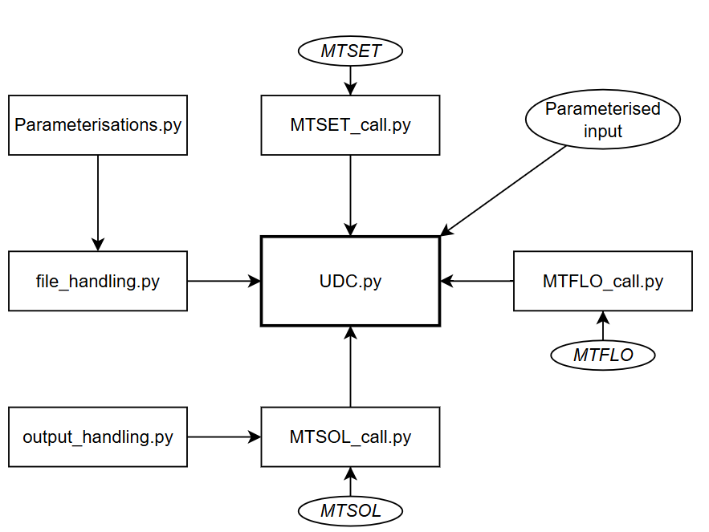
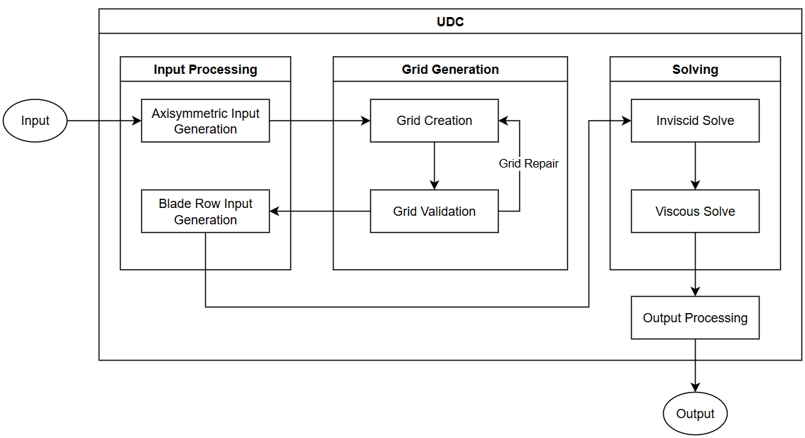
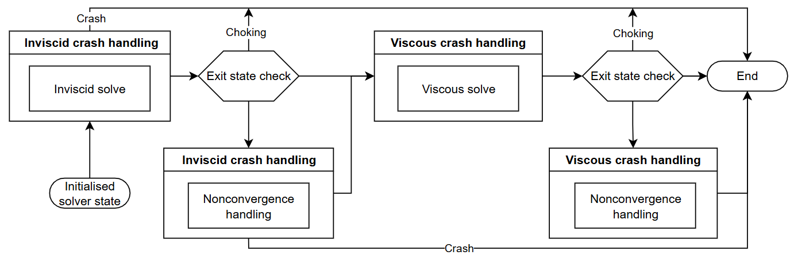
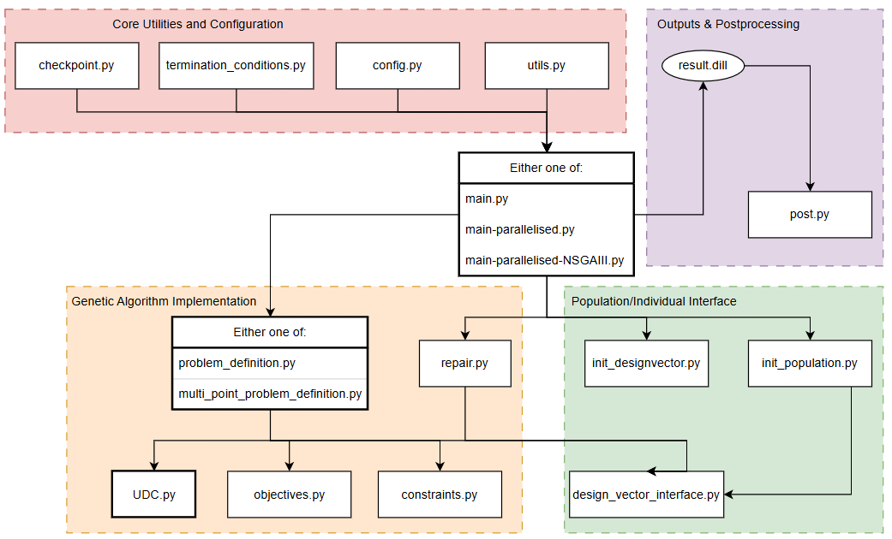

# The Unified Ducted fan Code and Ducted Fan Optimisation Framework

This repository contains the codebase developed for the **Unified Ducted fan Code (UDC)** and its implementation into a ducted fan optimisation framework using the **Unified Non-dominated Sorting Genetic Algorithm III (U-NSGA-III)**.

The UDC was first developed in T.S. Vermeulen's [MSc thesis](https://repository.tudelft.nl/record/uuid:21c8fb7b-f2d5-4c79-a43c-367cc1537764), and subsequently improved and expanded during the corresponding author's PhD project in late 2025/early 2026 to support the writing of a conference paper for the ASME 2026 Turbo Expo [1] and accompanying journal article in the Journal of Engineering for Gas Turbines and Power [2].

## Description

The UDC builds on and integrates the existing **MTFLOW** software developed by M. Drela in a wrapper, in order to create a fast, robust, and accurate ducted fan analysis code. This code is implemented in the U-NSGA-III genetic algorithm to enable design explorations for different operating conditions, objectives, and constraints.

Simplified diagrams of the UDC are presented below, illustrating both the connections between the various Python modules and the sequential solving strategy employed in the UDC.







For more details on the different (sub-)modules of the UDC, please refer to Appendix C.1 of the [MSc thesis](https://repository.tudelft.nl/record/uuid:21c8fb7b-f2d5-4c79-a43c-367cc1537764), and/or the documentation present within each file in this repository.

### The Optimisation Framework

The developed modular ducted fan optimisation framework in this repository integrates the UDC into a customised, mixed-variable (continuous + integer) U-NSGA-III genetic algorithm. A file diagram of the developed optimisation framework is shown below:



For more details on the different (sub-)modules of the optimisation framework, please refer to Appendix C.2 of the [MSc thesis](https://repository.tudelft.nl/record/uuid:21c8fb7b-f2d5-4c79-a43c-367cc1537764), and/or the documentation present within each file in this repository.

## Repository Structure

```bash
.
├── CITATION.cff
├── CONTRIBUTING.md
├── GA
│   ├── __init__.py
│   ├── checkpoint.py
│   ├── config.py
│   ├── config_original.py
│   ├── constraints.py
│   ├── design_vector_interface.py
│   ├── init_designvector.py
│   ├── init_population.py
│   ├── main-parallelised-UNSGAIII.py
│   ├── main-parallelised.py
│   ├── main.py
│   ├── multi_point_problem_definition.py
│   ├── objectives.py
│   ├── post.py
│   ├── problem_definition.py
│   ├── README.md
│   ├── repair.py
│   ├── termination_conditions.py
│   └── utils.py
├── LICENSE
├── README.md
├── Submodels
│   ├── MTFLO_call.py
│   ├── MTSET_call.py
│   ├── MTSOL_call.py
│   ├── Parameterisations.py
│   ├── README.md
│   ├── Test Airfoils
│   │   ├── duct.dat
│   │   ├── n0012.dat
│   │   ├── n0015.dat
│   │   ├── n0025.dat
│   │   ├── n0050.dat
│   │   ├── n1412.dat
│   │   ├── n24012.dat
│   │   ├── n2412.dat
│   │   ├── n2414.dat
│   │   ├── n2415.dat
│   │   ├── n6409.dat
│   │   ├── n6509.dat
│   │   ├── naca6412.dat
│   │   └── whitcomb.dat
│   ├── __init__.py
│   ├── file_handling.py
│   └── output_handling.py
├── UDC.py
├── Validation
│   ├── DFDC
│   │   ├── DFDC_run_J.py
│   │   ├── beta_19.case
│   │   ├── beta_29.case
│   │   ├── dfdc_beta19.csv
│   │   └── dfdc_beta29.csv
│   ├── Profiles
│   │   ├── Dstrut.dat
│   │   ├── Hstrut.dat
│   │   ├── X22_02R.dat
│   │   ├── X22_03R.dat
│   │   ├── X22_04R.dat
│   │   ├── X22_05R.dat
│   │   ├── X22_06R.dat
│   │   ├── X22_07R.dat
│   │   ├── X22_08R.dat
│   │   ├── X22_09R.dat
│   │   └── X22_10R.dat
│   ├── README.md
│   ├── Validation Data.xlsx
│   └── X22A Propeller Design Data.xlsx
├── X22A_validator.py
├── __init__.py
├── analyse_performance.py
└── requirements.txt
```

The `./GA/` folder contains the developed **ducted fan optimisation framework**. To execute an optimisation, the configuration needs to be set in `./GA/config.py`. An interface may then be chosen from `main.py`, `main-parallelised.py`, or `main-parallelised-UNSGAIII.py`, where the first and last implement the U-NSGA-III algorithm, while `main-parallelised.py` implements a basic "plain" genetic algorithm. For more details on the genetic algorithm implementation, see the dedicated README.

The `./Submodels/` folder contains 3 MTFLOW subprocess wrappers (MTSET, MTFLO and MTSOL), and processing scripts. For a description of the different programs within MTFLOW, the reader is referred to the [MTFLOW user manual](https://web.mit.edu/drela/Public/web/mtflow/mtflow.pdf).

The `./Validation/` folder contains the data and summarised results used to validate the implementation of the UDC against experimental wind tunnel data of the **X-22A 3-bladed ducted propeller** (see details in the related [MSc thesis](https://repository.tudelft.nl/record/uuid:21c8fb7b-f2d5-4c79-a43c-367cc1537764)). The geometry and experimental test results for the propeller are given in [NASA-TN-D-4142](https://ntrs.nasa.gov/citations/19670025554). Part of the validation is made with the **Ducted Fan Design Code (DFDC)**, using a Python wrapper written by Bram Meijerink. DFDC is free and open-source software distributed under the GNU General Public License (GPL). See more in [https://web.mit.edu/drela/Public/web/dfdc/](https://web.mit.edu/drela/Public/web/dfdc/). The validation data is included in this repository as the geometry was is used in the test-cases present within the code, and in [1,2], to run the UDC and optimisation framework.

## Installation

### Requirements

To run the UDC or the developed optimisation framework, the dependencies listed below must be satisfied. A requirements.txt file is provided as part of this repository. To improve performance, it is suggested to install pymoo last during the installation process, using following the command, as per the instructions in the pymoo documentation. This attempts to install some of the Pymoo dependencies in compiled form, which may speed up analyses.

```console
pip install -U pymoo==0.6.1.5
```

- Pymoo 0.6.1.5 (Optimisation framework only)
- Ambiance 1.3.1
- NumPy 2.2.1
- SciPy 1.16.3
- Matplotlib 3.10.7
- Dill 0.4.0 (Optimisation framework only)
- Pandas 2.3.3

Use the `./requirements.txt` file to install all dependencies and the corresponding versions. As a reference, the tools and frameworks were developed using Python 3.12.8. Although the author sees no issues with usage at other Python versions, no guarantees are given.

### Usage

To run **new optimisations**, users need to install MTFLOW. In order to access and use MTFLOW, users must request a license for MTFLOW directly from the [MIT Technology Licensing Office](https://tlo.mit.edu/industry-entrepreneurs/available-technologies/mtflow-software-multielement-through-flow). Once MTFLOW is installed, run either `./GA/main.py` (for single-threaded execution), `./GA/main-parallelised.py` (for multi-threaded execution) or `./GA/main-parallelised-UNSGAIII.py` (for multi-threaded execution using the U-NSGA-III algorithm).  

To **load and visualise optimisation results**, users can run `./GA/post.py` (does not require MTFLOW), provided the respective settings in `./GA/config.py` and the relative path to the respective optimisation results `.dill` file (see documentation in `./GA/post.py`).

**Keep in mind**

- The UDC and optimisation framework have been designed to work on Windows. Since version 2.0, support has been added for Linux/Unix-like systems, which offer significant computational performance improvements.
- For best performance, it is recommended to run the optimisation framework on a computer or server with as many CPU cores/threads as possible, since each thread can be used to run one analysis. Testing of the developer shows 16 analyses can be conducted simultaneously on an AMD Ryzen 5xxx 8-core/16-thread CPU. An average design takes between 3--45 seconds to evaluate in the UDC, depending on the design, operating conditions, hardware used, and operating system.  

## Author(s)

The code scripts provided in this repository have been developed by
**Thomas Vermeulen**  [0009-0000-0182-0244](https://orcid.org/0009-0000-0182-0244), Technische Universiteit Delft

## License

The code provided in this repository is released open-source under an MIT license (see `./LICENSE`).

Copyright notice:

Technische Universiteit Delft hereby disclaims all copyright interest in the program “The Unified Ducted Fan Code and Ducted Fan Optimisation Framework” written by the Author(s).  
Henri Werij, Dean of Faculty of Aerospace Engineering, Technische Universiteit Delft.

&copy; 2024-2026, T. S. Vermeulen

## How to cite this code?

If you use this code, please cite it as below or check out the `./CITATION.cff` file.

How to cite this repository: Vermeulen, Thomas (2025): The Unified Ducted Fan Code and Ducted Fan Optimisation Framework. Version 1. 4TU.ResearchData. software. [https://doi.org/10.4121/efc63362-65e5-4c5d-b787-27e44dafa52a](https://doi.org/10.4121/efc63362-65e5-4c5d-b787-27e44dafa52a)

## References

[1] Vermeulen, T.S., Visser, W.P.J., Sinnige, T., Wood, N.J., 2026. "A Medium-Fidelity Modelling Framework for Ducted E-Fan Design". Proceedings of ASME Turbo Expo 2026 Turbomachinery Technical Conference and Exposition (GT2026). ASME Paper No. GT2026-175354.  

[2] Vermeulen, T.S., Visser, W.P.J., Sinnige, T., Wood, N.J., 2026. "A Medium-Fidelity Modelling Framework for Ducted E-Fan Design". ASME Journal of Engineering for Gas Turbines and Power. ASME Paper No. GTP-26-1236.

## Funding

Version 2.0 of this repository was conducted by DASAL (Dutch Aviation Systems Analysis Lab), which is a project within the research and innovation program ‘Luchtvaart in Transitie’. Luchtvaart in Transitie is co-funded by the National Growth Fund.

## Would you like to contribute?

If you have any comments, feedback, or recommendations, feel free to open an issue.

If you would like to contribute directly, you are welcome to fork this repository (see `./CONTRIBUTING.md`).
